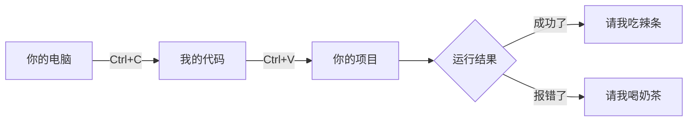

# JavaStudy
CDIVTC软件技术大一在读
初入GitHub 求高手指点
# 👋 你好啊，GitHub宇宙的冒险者！

欢迎光临本萌新的代码小卖部！这里是**CDIVTC软件技术大一在读萌新**的代码仓库，主要贩卖：
- 🧑💻 刚出锅的Java练习代码（可能还带着语法错误的葱花）
- 📚 学习笔记（字迹潦草，建议配合防眩晕眼镜使用）
- 🍜 深夜debug时产生的玄学代码（附带秃头警告）

---

## 🛸 仓库使用说明书

```java
public class MyProfile {
    public static void main(String[] args) {
        String 身份 = "GitHub萌新";
        String 技能 = "会写HelloWorld的究极进化版";
        String 状态 = "正在与Java的;和{}进行激烈搏斗";
        boolean 是否在吃宵夜 = true; // 代码写不好？炫碗泡面再说！
        
        System.out.println("欢迎参观我的代码动物园🐾");
    }
}
```

---

## 🤝 盟友招募令

正在寻找：
- 👯 **夜宵代码搭子**（泡面我包，bug你调）
- 🧑🏫 **Java老司机**（求带飞，可以当人形报错提示器）
- 👶 **同年级萌新**（一起从入门到入土）

合作方式：
1. 点击右上角✨Star按钮获取本店VIP卡
2. 在issue区留下你的通关密语（比如："Java是世界上最好的语言"——鲁迅没说过）
3. 扫码加入深夜代码养生局（暗号：老板，加个荷包蛋）

---

## 📮 接头方式

  
QQ: `123456789（验证答案：System.out.println("救命");）`  
Email: [coder_xiaobai@xxx.com](mailto:coder_xiaobai@xxx.com)

---

## 🛸 星际导航



---

🙇 **萌新鞠躬三连**  
[](https://github.com/yourusername)  
（小声）要是能有个star...今晚泡面都能加卤蛋了...✨